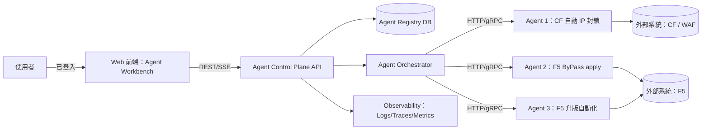
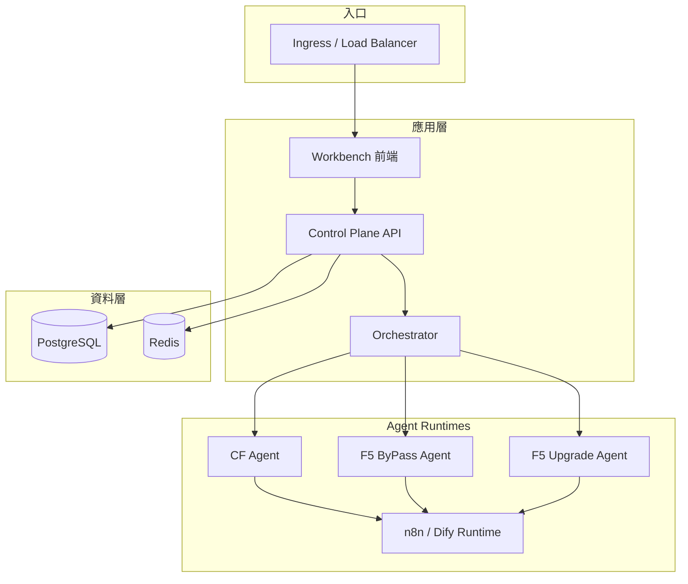
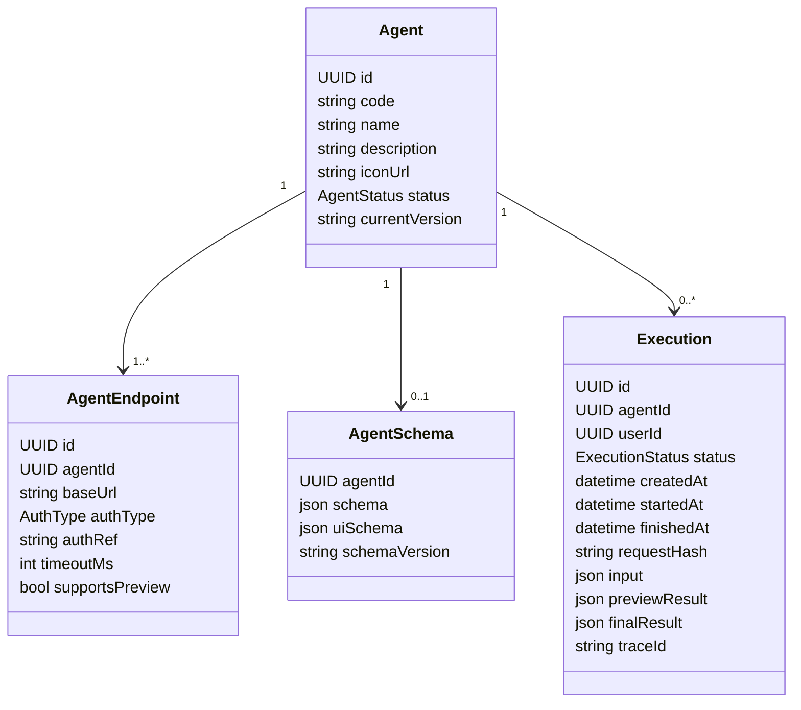
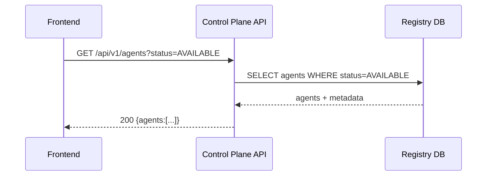
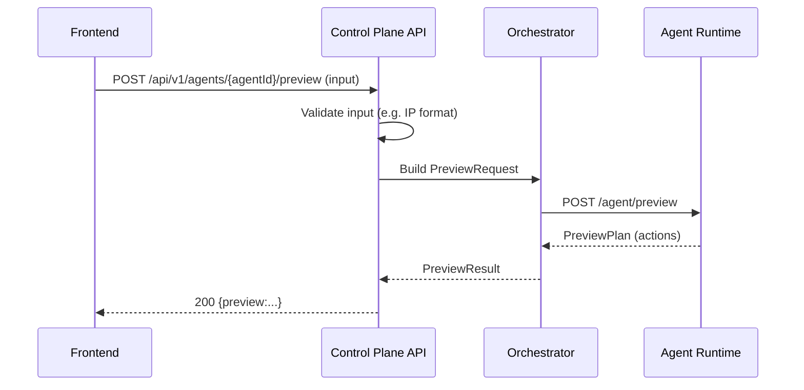
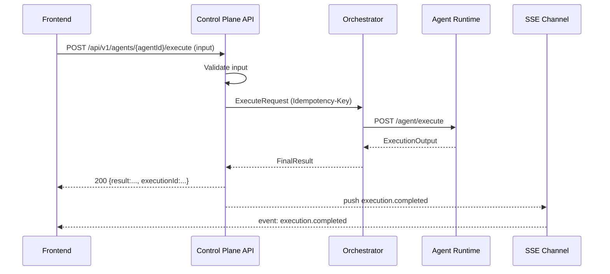
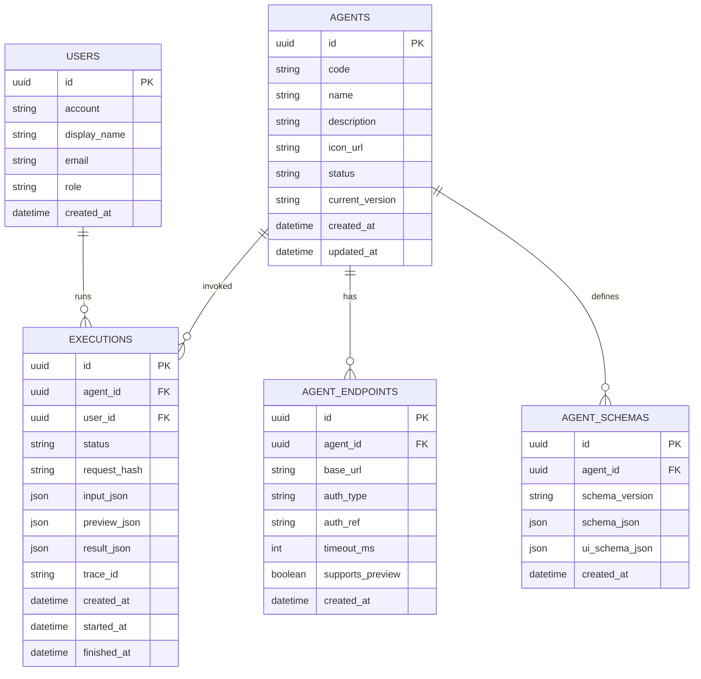

# Across AI Agent 自動化平台 — 軟體系統設計規格書（SDD）
- 文件版本：0.1
- 文件日期：2025-12-12
- 需求來源：Across 功能需求文件_20251211版.txt

> 註：需求文件內容僅涵蓋 FR-Agent-001 與 FR-Agent-002，且中間出現省略符號「...」。因此，下列設計中凡超出需求文件明確描述之處，均以「技術假設」標註，並以可落地實作為前提。

---

## 1. 系統概述

### 1.1 目的
建立一套「Agent Workbench」介面與後端控制面（Control Plane），讓使用者登入後可瀏覽所有已部署且狀態為「可用」的特定 AI Agent，並支援「預覽執行」與「執行」兩種模式。

### 1.2 範圍
- **In Scope**
  - Agent Workbench：可用 Agent 清單展示、Agent 選取、輸入介面、預覽執行、正式執行、執行結果/通知。
  - Agent 開發與部署流程：Agent 邏輯開發、單元測試、容器化部署、API 介面、Agent 註冊與狀態管理。
  - 至少支援三個 Agent 的展示（最終驗收）：
    Agent 1：CF - 自動 IP 封鎖、Agent 2：F5 - 誤封鎖 ByPass apply、自動化、Agent 3：F5 - 升版自動化。
- **Out of Scope（需求未描述，若後續需求補齊可再擴充）**
  - Agent 內部的具體商務規則、外部系統（Cloudflare/F5 等）API 權限模型與欄位細節。
  - 既有登入/身分系統的具體協定與整合方式（僅知道「使用者已成功登入」為前置條件）。

### 1.3 利益相關者（Stakeholders）
- 使用者：需要在 Workbench 上啟動 Agent 的操作人員。
- PM：需求文件作者與驗收方。
- 開發/部署/DB 負責角色：文件列出分工（UI、串接、開發、部署、DB）。

---

## 2. 需求解讀與設計對應

### 2.1 功能需求（FR）

#### FR-Agent-001：Agent Workbench 介面顯示與執行
- 顯示：登入後可瀏覽所有「已部署且可用」的特定 Agent 清單與 Metadata（名稱、簡短描述、圖示/縮圖）。
- 操作：點擊 Agent → 彈出輸入介面（Modal 或專屬頁）。
- 預覽：按「預覽執行」後，在彈窗顯示 Agent Flow 預期動作/結果（例：將被封鎖 IP 清單、規則設定等）。
- 例外：輸入驗證失敗需即時提示並阻擋；服務連線失敗需顯示固定錯誤文案。
- 驗收：三個 Agent 清單可見；Agent 1 可完成實際封鎖動作；預覽與執行邏輯一致；執行成功需即時提供結果或完成通知。

#### FR-Agent-002：特定 AI Agent 開發與部署
- 需能開發並部署至少 N 個獨立 Agent，後端穩定運行，可被 Workbench 調用。
- Agent 開發流程：n8n/Dify 等框架撰寫邏輯、單元測試、Docker 化、部署、API、與前端通信、註冊到 Agent 庫並標記為可用。
- 例外：部署失敗需警報並標記維護/不可用；運行錯誤需穩定錯誤處理並回傳友善訊息。
- 驗收：Agent 1 穩定；各 Agent 測試案例通過；部署後可在「Agent 服務中心介面」顯示；啟動後 5 秒內成功響應。

### 2.2 非功能需求（NFR）— 由驗收條件推導
- **回應時間**：使用者點擊啟動 Agent 後，5 秒內成功響應（至少回傳可用結果或執行受理）。
- **可用性**：Agent 服務異常需以可用/維護/不可用狀態控管，並對前端提供友善錯誤。
- **輸入驗證**：需於前端互動時即時檢核（例如 IP 格式）。
- **一致性**：預覽結果與最終執行結果在邏輯上保持一致。

---

## 3. 系統架構設計

### 3.1 整體架構（邏輯）
**技術假設 A1**：採用「控制面（Agent Control Plane）」+「運行面（Agent Runtimes）」的分離架構；Workbench 只與 Control Plane 互動，由 Control Plane 路由到各 Agent 服務。

### 3.2 技術堆疊（建議落地版本）
**技術假設 A2**：需求文件僅指出 Agent 可用 n8n/Dify、可用 Docker 部署 ；本 SDD 選定一組可實作的堆疊以便開發落地。
- 前端：Vue 3 + TypeScript + Vite（Workbench/服務中心 UI）
- 後端：Go（Gin）— Agent Control Plane API + Orchestrator
- Agent Runtime：n8n（Workflow）或 Dify（Agent），以「標準 Agent Adapter 介面」對外提供 preview/execute
- 資料庫：PostgreSQL（Agent/Execution/Audit）、Redis（快取/短期狀態）
- 通知：Server-Sent Events（SSE）
- 部署：Docker + Kubernetes（或最小落地 Docker Compose）
- 觀測性：OpenTelemetry + Prometheus + Grafana + Loki

### 3.3 部署架構（參考）
**技術假設 A3**：服務部署於雲端或本地皆可，文件允許兩者 ；此處以 Kubernetes 為主。

---

## 4. 模組設計

### 4.1 模組切分
1. **Workbench UI（使用者面）**
   - Agent 列表展示（僅顯示 AVAILABLE）
   - Agent 輸入表單（Modal 或專屬頁）
   - 預覽執行與結果顯示
   - 執行與通知（即時回饋）
2. **Agent Service Center（管理面）**
   - 顯示已註冊 Agent、狀態與健康度（需求稱「Agent 服務中心介面」）
3. **Agent Control Plane API**
   - Agent 查詢、schema、preview、execute、execution 查詢
4. **Agent Orchestrator**
   - 依 Agent 註冊資訊呼叫對應 Runtime
   - timeout、重試、幂等、錯誤轉譯
5. **Agent Registry（DB）**
   - Agent 元資料、端點、狀態、版本管理

### 4.2 核心領域模型（Class Diagram）

### 4.3 主要流程（Sequence Diagrams）

#### 4.3.1 Workbench 載入 Agent 清單

對應需求：顯示所有可用 Agent 與 metadata

#### 4.3.2 預覽執行

對應需求：預覽顯示 Agent Flow 預期動作/結果

#### 4.3.3 正式執行 + 通知

對應需求：完成實際動作與即時通知

---

## 5. 資料庫設計

### 5.1 ER 圖

### 5.2 資料表（精簡版）
**技術假設 A7**：需求未定義「執行歷史」與「稽核」是否必須；本設計納入以支撐可維護性與可追溯性。

- `agents`：Agent 元資料與狀態（AVAILABLE/MAINTENANCE/UNAVAILABLE）
- `agent_endpoints`：每個 Agent 的 baseUrl、timeout、授權方式 reference
- `agent_schemas`：動態表單 schema
- `executions`：每次 preview/execute 的輸入、結果摘要與追蹤 ID

索引：`agents(status)`、`executions(agent_id, created_at desc)`、`executions(user_id, created_at desc)`。

---

## 6. API 介面設計

### 6.1 端點總覽
| 功能 | 方法 | 路徑 |
|---|---:|---|
| 取得可用 Agent 清單 | GET | `/api/v1/agents?status=AVAILABLE` |
| 取得 Agent schema | GET | `/api/v1/agents/{agentId}/schema` |
| 預覽執行 | POST | `/api/v1/agents/{agentId}/preview` |
| 正式執行 | POST | `/api/v1/agents/{agentId}/execute` |
| 查詢執行狀態/結果 | GET | `/api/v1/executions/{executionId}` |
| SSE 訂閱 | GET | `/api/v1/events` |

### 6.2 錯誤處理
- 輸入驗證失敗：HTTP 400（前端需即時顯示並阻擋）
- Agent 服務不可用/連線失敗：HTTP 503，回應 `message` 固定為
  「Agent 服務暫時不可用，請稍後再試」

---

## 7. 安全性設計

### 7.1 身份驗證
**技術假設 A5**：沿用既有登入機制（OIDC/SAML/JWT）。需求只定義「已登入」為前置條件。

### 7.2 授權
**技術假設 A6**：RBAC；至少區分「可執行 Agent」與「可管理 Agent 註冊/狀態」。

### 7.3 外部系統憑證
- 外部系統（CF/F5）金鑰不落 DB 明文；DB 僅存 reference（`auth_ref`），實際 secret 由 Vault/K8s Secret 管理。

---

## 8. 效能與擴展性

- 5 秒內成功響應：execute 端點採「同步成功」或「202 + executionId」兩段式，確保前端互動 SLA。
- Orchestrator 對外部系統呼叫：統一 timeout、重試（僅針對可安全重試的操作）、限流（技術假設）。
- 快取：Agent 清單與 schema 走 Redis，降低 DB 壓力。

---

## 9. 錯誤處理與日誌

- 例外流程需求：輸入驗證失敗與服務連線失敗處理
- 部署失敗警報：落地於 CI/CD 或 K8s 監控告警
- 日誌：結構化、可追蹤 traceId；對敏感欄位做遮罩（技術假設）。

---

## 10. 測試策略

- Agent 單元測試：需求明確要求「單元測試」
- 端對端驗收：覆蓋 Agent 清單顯示、Agent 1 可完成封鎖、預覽/執行一致、通知回饋
- 效能測試：驗證 5 秒響應要求

---

## 11. 技術假設清單
- A1：Control Plane + Runtime 分離
- A2：選定前後端與觀測性堆疊（需求僅明確提到 n8n/Dify、Docker）
- A3：以 Kubernetes 作為主要部署形態（雲端/本地皆可）
- A4：以 JSON Schema 驅動動態表單（需求未定義各 Agent I/O）
- A6：RBAC 權限模型（需求未描述）
- A7：納入 executions/audit 等可觀測資料模型（需求未明示，但支撐可維護性）
