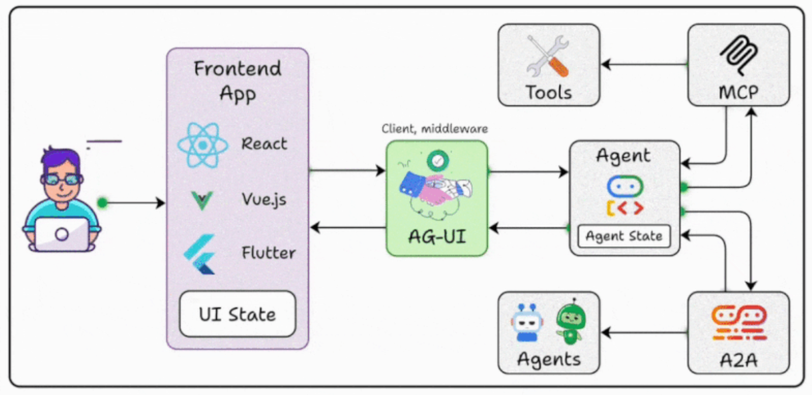

# 🔍 系統架構 Dify 可行性分析報告

### 系統架構圖

**主題**：Google ADK 與 AG-UI 架構中，可由 Dify 平台（LLM 開發平台）實現的功能模組分析  
**目的**：評估 Dify 在該系統中的適用性、可實施範圍與限制  
**依據**：提供的 GIF 系統圖、Dify 官方功能清單（工作流程、RAG、Agent 模式、API 整合等）

---

## 🧩 一、整體架構概覽
圖中主要組件如下：

| 類別 | 模組名稱 | 功能說明 |
|------|-----------|----------|
| 前端層 | React / Vue.js / Flutter + UI State | 提供使用者介面與狀態管理 |
| 中介層 | AG-UI (Client, middleware) | 管理請求、狀態、前後端通訊 |
| 推理層 | Agent + Agent State | LLM 驅動邏輯與任務規劃 |
| 協作層 | Agents / A2A | 多 Agent 協同 |
| 工具層 | Tools + MCP | Agent 可調用的外部服務或模型上下文協議 |
| 輔助功能 | A2A、RAG、Prompt、LLM 整合 | 增強 AI 推理與知識應用 |

---

## ⚙️ 二、Dify 可實現功能對照分析

### A. AI 推理與 Agent 層

| 模組 | 可由 Dify 實現 | 對應功能 | 實作方式 |
|------|----------------|------------|-----------|
| **Agent / Agent State** | ✅ 完全可實現 | Agent 模式、對話記憶、工作流程 | 以 Dify 的 Agent App 建立推理邏輯，使用 session 記憶保存狀態 |
| **Agents（多 Agent）** | ✅ 可部分擴充 | 多應用部署 / Workflow 路由 | 建立多個 Dify 應用或在同一 Workflow 內分支路由不同子任務 |
| **A2A（Agent to Agent）** | ⚠️ 部分可實現 | Workflow + API 呼叫 | 以 HTTP 節點串接多 Agent 輸入輸出；非原生協議 |

---

### B. 工具與外部整合層

| 模組 | 可由 Dify 實現 | 對應功能 | 實作方式 |
|------|----------------|------------|-----------|
| **Tools** | ✅ 完全可實現 | API 調用、資料庫連接、Webhook | 在 Workflow 中設置 HTTP 請求節點與變數處理 |
| **MCP (Model Context Protocol)** | ⚠️ 部分可實現 | API 橋接 | 建立轉接 API，由 Dify 的 HTTP 工具節點呼叫 MCP 端點（非原生支援） |

---

### C. 知識與資料處理層

| 模組 | 可由 Dify 實現 | 對應功能 | 實作方式 |
|------|----------------|------------|-----------|
| **RAG / 知識庫** | ✅ 完全可實現 | 知識庫管理、文件向量化 | 上傳文件 → 建立資料集 → 啟用檢索增強生成 |
| **資料處理 / 轉換** | ✅ 完全可實現 | Workflow 節點 / 模板格式化 | 使用節點做清洗、抽取、結構化輸出 |

---

### D. 提示詞與 LLM 整合層

| 模組 | 可由 Dify 實現 | 對應功能 | 實作方式 |
|------|----------------|------------|-----------|
| **提示詞工程** | ✅ 完全可實現 | 模板管理、變數注入、版本控制 | 在 Dify 設定模板與變數，支援 A/B 測試與版本回滾 |
| **LLM 整合** | ✅ 完全可實現 | 模型選擇與供應商整合 | 配置 OpenAI / Anthropic / 本地模型於節點中使用 |

---

### E. 對話管理與前端協作層

| 模組 | 可由 Dify 實現 | 對應功能 | 實作方式 |
|------|----------------|------------|-----------|
| **對話管理 / Agent State** | ✅ 完全可實現 | 對話記憶、多輪互動 | 啟用 Dify 的上下文記憶與歷史控制 |
| **Frontend App (React / Vue / Flutter)** | ⚠️ 部分可實現 | 提供 API / SDK | 前端自行開發，透過 HTTP 呼叫 Dify API；UI 狀態仍由前端維護 |
| **AG-UI (中介層)** | ⚠️ 部分可實現 | Webhook / API 協作 | Dify 作為 AI 推理後端，由 AG-UI 管控金鑰、驗證與回呼流程 |

---

## 🚫 三、Dify 不適合直接承擔的功能

| 模組 | 原因 |
|------|------|
| **前端 UI 與狀態管理** | 屬前端框架職責，Dify 不負責視覺與互動邏輯 |
| **AG-UI 中介邏輯** | Dify 不取代自建 BFF / middleware，僅可互通 |
| **MCP 原生支援** | 無確證 Dify 具原生 MCP 協議支援 |
| **A2A 協議層** | Dify 可透過 API 串接多 Agent，但無特定協議層實作 |

---

## 🧭 四、建議落地路徑

1. **以 Dify Workflow 為核心推理引擎**  
   - 在節點內建立多步推理與工具調用。  
   - 配合條件分支與變數控制工作流程。  

2. **建置知識庫 (RAG) 與模板**  
   - 將私有文件上傳 Dify 資料集並啟用檢索增強生成。  
   - 使用提示詞模板維持輸出一致性。  

3. **前端與 AG-UI 協作**  
   - 由 AG-UI 管控前端請求與金鑰驗證。  
   - Dify 提供 REST API 或 Webhook 介面回應結果。  

4. **整合外部 MCP 或服務**  
   - 以 HTTP 工具節點橋接至 MCP Gateway。  

5. **多 Agent / A2A 模式**  
   - 以多個 Dify 應用部署不同角色 Agent。  
   - 透過 Workflow 或 API 串接模擬協同互動。  

---

## ✅ 五、總結結論

| 分類 | 可由 Dify 完成 | 備註 |
|------|----------------|------|
| Agent / Workflow / 對話管理 | ✅ | 完全支援 |
| 知識庫 (RAG) / 提示詞 / 模型整合 | ✅ | 完全支援 |
| 工具 / API 整合 | ✅ | 可直接配置 |
| 多 Agent / A2A / MCP | ⚠️ | 部分可行（透過 Workflow 或轉接 API） |
| 前端與中介層 | ❌ | 需外部框架自行實作 |

**整體評估**：  
Dify 可作為整個架構的「智能核心層」與「工作流程引擎」，負責推理、RAG、工具調用與狀態管理；但前端展示與中介協議需由外部組件（如 AG-UI、React/Vue）承擔。

---
**產出者**：Jeff

**檔案格式**：Markdown 報告  

**最後更新**：2025-11-03
