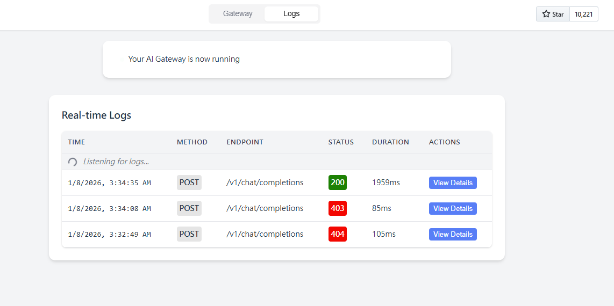

# 研究 AI Gateway 筆記

## 資訊連結：
- https://github.com/Portkey-AI/gateway
- https://github.com/Portkey-AI/gateway/blob/main/.github/README.cn.md#supported-sdks
- https://drive.google.com/file/d/11X2SbmKVwGkPHudrbkVKHC9FN4xuSL7a/view?usp=sharing
- https://codewiki.google/github.com/portkey-ai/gateway#ai-gateway-core-functionality

- https://github.com/helicone/helicone


## 開源版和付費版本的差異

Portkey AI Gateway 的 **開源版本** （Open Source）與 **付費版本** （包含 Enterprise 企業版與 Hosted 雲端託管版）在功能權限、安全性、管理能力及支援服務上有顯著差異。

以下是兩者的詳細對比：

1\. 核心功能與進階工具

-  **開源版本：**  提供基礎且高效的 AI 網關功能，包括支援超過 250 種大型語言模型（LLM）的路由、自動重試（Retries）、回退機制（Fallbacks）、負載均衡（Load Balancing）以及基礎的 Guardrails 防護,,。

-  **付費版本（Hosted/Enterprise）：**  提供更強大的管理工具，例如：

◦  **語義快取（Semantic Caching）：**  除了簡單快取外，付費版支援語義快取，能更聰明地節省成本並降低延遲,。

◦  **提示詞範本管理（Prompt Management）：**  提供通用的提示詞遊樂場（Playground），支援提示詞的版本管理與協作,。

◦  **日誌與觀測性（Logging & Observability）：**  針對 Agent 框架提供完整的日誌紀錄、追蹤與觀測功能。

◦  **供應商優化（Provider Optimization）：**  根據使用模式自動切換至成本效益最高的供應商。

2\. 安全性與合規性

-  **開源版本：**  雖然具備基礎的 Guardrails 和金鑰管理，但更進階的安全控管主要集中在付費版。

-  **付費版本（Enterprise）：**

◦  **隱私數據脫敏（PII Redaction）：**  自動從請求中移除敏感數據，防止資訊外洩。

◦  **存取控制與入站規則：**  可根據 IP 或地理位置（Geo）限制連線。

◦  **企業級合規：**  符合  **SOC2、ISO、HIPAA、GDPR 及 CCPA**  等國際安全與數據隱私規範,。

3\. 部署與管理

-  **開源版本：**  採用 MIT 授權，可於本地（Node.js/npm）或 Docker 環境快速部署,,。

-  **付費版本（Enterprise）：**  支援在  **AWS、Azure、GCP、OpenShift 或 Kubernetes**  等私有雲環境進行部署。此外，還包含進階的**組織管理（Org management）**與治理功能，方便大規模團隊使用。

4\. 技術支援

-  **開源版本：**  主要透過社群論壇、GitHub Issues 以及每週五的社群通話（Community Calls）獲取支援,,。

-  **付費版本：**  提供 **專業技術支援（Professional Support）** 、24/7 頂級支援服務，並享有功能的優先開發權,。

---

## 詳細功能清單及差異

### Portkey AI Gateway 的功能可劃分為核心功能（開源版可用）以及進階功能（雲端託管版與企業版專屬）。
### 以下是詳細的功能清單對照：

1\. 核心路由與可靠性 (Reliability)

此類別多數功能在開源版中均有提供，旨在確保 AI 請求的穩定性。

| 功能項目 | 開源版 (Open Source) | 雲端版 / 企業版 (Hosted / Enterprise) |
| --- | --- | --- |
| **支援 LLM 數量** | 250+ 種模型 | 250+ 種模型 |
| **自動重試 (Retries)** | ✅ (最高 5 次) | ✅ |
| **回退機制 (Fallbacks)** | ✅ | ✅ |
| **負載均衡 (Load Balancing)** | ✅ | ✅ |
| **請求超時管理 (Timeouts)** | ✅ | ✅ |
| **多模態與實時 API 支援** | ✅ | ✅ |
| **供應商自動優化** | ❌ | **✅ (根據成本/效能自動切換)** |

2\. 效能與成本控管 (Cost & Performance)

付費版本在節省成本與大規模管理上具備更強的技術。

| 功能項目 | 開源版 (Open Source) | 雲端版 / 企業版 (Hosted / Enterprise) |
| --- | --- | --- |
| **基礎快取 (Simple Caching)** | ✅ | ✅ |
| **語義快取 (Semantic Caching)** | ❌ | **✅ (基於語義相似度觸發)** |
| **使用量分析 (Usage Analytics)** | ✅ (包含成本、延遲監控) | ✅ |
| **提示詞範本管理 (Prompt Mgmt)** | ❌ | **✅ (包含版本管理與遊樂場)** |

3\. 安全性與合規性 (Security & Compliance)

企業版提供了更嚴格的數據治理與隱私保護工具。

| 功能項目 | 開源版 (Open Source) | 雲端版 / 企業版 (Hosted / Enterprise) |
| --- | --- | --- |
| **AI 防護欄 (Guardrails)** | ✅ (50+ 種) | ✅ |
| **虛擬金鑰管理** | ✅ | ✅ |
| **角色權限控制 (RBAC)** | ⚠️ (基礎) | **✅ (進階組織與工作區管理)** |
| **隱私數據脫敏 (PII Redaction)** | ❌ | **✅ (自動移除敏感資訊)** |
| **入站規則 (Inbound Rules)** | ❌ | **✅ (IP 與地理位置連線限制)** |
| **國際合規認證** | 部分支援 | **✅ (SOC2, ISO, HIPAA, GDPR, CCPA)** |

4\. AI Agent 觀測與管理

針對複雜的 Agent 工作流，付費版提供深度的追蹤能力。

| 功能項目 | 開源版 (Open Source) | 雲端版 / 企業版 (Hosted / Enterprise) |
| --- | --- | --- |
| **Agent 框架整合** | ✅ (Autogen, CrewAI 等) | ✅ |
| **日誌與追蹤 (Logging & Tracing)** | ⚠️ (僅限本地日誌) | **✅ (進階 Agent 追蹤)** |
| **觀測性 (Observability)** | ❌ | **✅ (專屬 Agent 監控工具)** |

5\. 部署與技術支援

開源版側重於社群驅動，而企業版則專注於私有化與專業服務。

| 功能項目 | 開源版 (Open Source) | 企業版 (Enterprise) |
| --- | --- | --- |
| **部署方式** | 本地 (npx), Docker, Node.js | **私有雲 (AWS, Azure, GCP, K8s)** |
| **技術支援** | 社群論壇、GitHub、週五社群通話 | **24/7 專業支援、功能優先開發權** |
| **授權協議** | MIT 授權 | 企業授權 |

--------------------------------------------------------------------------------

 **比喻說明：**    **開源版** 就像是提供你一組 **強大的引擎與方向盤** （核心路由與可靠性），讓你能自己組裝出一台性能極佳的賽車。而 **雲端版與企業版** 則是在賽車基礎上加裝了 **全自動巡航系統** （供應商優化）、 **高科技防盜鎖與裝甲** （PII 脫敏與安全合規），並附帶一組 **專業維修車隊** （24/7 支援），讓你在企業級的商業賽道上跑得既安全又高效。

---

## 評估及分析可行性。
- 希望將 https://github.com/Portkey-AI/gateway 功能 合進至 https://github.com/jeff-cheng101/Across-AI 中。

### 安裝方法

### A. Docker（最直接）

- 以官方 Docker image 啟動（預設對外埠 8787） [hub.docker.com](https://hub.docker.com/r/portkeyai/gateway?utm_source=chatgpt.com)

    - `docker run -d -p 8787:8787 portkeyai/gateway:latest`
    - `docker run --rm -p 8787:8787 portkeyai/gateway:latest`

### B. Docker Compose

- 下載 repo 的 compose 檔並啟動 [hub.docker.com](https://hub.docker.com/r/portkeyai/gateway?utm_source=chatgpt.com)

    - `wget "https://raw.githubusercontent.com/Portkey-AI/gateway/main/docker-compose.yaml"`
    - `docker compose up -d`

### C. NPM 套件（作為程式內依賴/SDK 或 gateway 套件形態）

- NPM 上存在 `@portkey-ai/gateway`，顯示可用於專案依賴；版本資訊與 OpenAI 相容性在頁面可查。

### WebUI

- http://localhost:8787/public/

---

### 測試範例

- test request
  
```json
curl -X POST \
      http://localhost:8787/v1/chat/completions \
      -H "Content-Type: application/json" \
      -H "x-portkey-provider: [Click to edit]" \
      -H "Authorization: [Click to edit]" \
      -d '{
        "messages": [
            { "role": "user", "content": "Hello, how are you?" }
        ],
        "model": """"
      }'
```

- 內容範例

```json
{
    "messages": [
        { 
            "role": "user", 
            "content": "Hello, how are you?" 
        }
    ],
    "model": "gemini-2.5-flash"
}
```

- Response

```json
{
    "id": "portkey-644d57db-5a07-434d-8c93-14235d1f0e41",
    "object": "chat.completion",
    "created": 1767843275,
    "model": "gemini-2.5-flash",
    "provider": "google",
    "choices": [
        {
            "message": {
                "role": "assistant",
                "content": "Hello! As an AI, I don't have feelings in the way humans do, but I'm functioning perfectly and ready to assist you.\n\nHow are you doing today?"
            },
            "index": 0,
            "finish_reason": "stop"
        }
    ],
    "usage": {
        "prompt_tokens": 7,
        "completion_tokens": 37,
        "total_tokens": 190,
        "completion_tokens_details": {
            "reasoning_tokens": 146,
            "audio_tokens": 0
        },
        "prompt_tokens_details": {
            "cached_tokens": 0,
            "audio_tokens": 0
        }
    }
}
```

- 針測log紀錄


---

## 2026/01/08 實驗

https://github.com/jeff-cheng101/Across-AI/tree/feature/AI-GateWay

### Planner Response

以下是本次修改的詳細說明以及設定啟動步驟：

### 📝 修改內容解譯

1.  **新增 [backend/docker-compose.yml](cci:7://file:///c:/work/TW/Across-AI/backend/docker-compose.yml:0:0-0:0)**
    *   這是用來在本地啟動 **Portkey AI Gateway** 的設定檔。
    *   它會下載並執行 `portkeyai/gateway:latest` 映像檔，並將服務開啟在 `8787` port。

2.  **修改 [backend/.env.example](cci:7://file:///c:/work/TW/Across-AI/backend/.env.example:0:0-0:0)**
    *   新增了 Portkey 相關的環境變數設定範本，包含開關 (`USE_PORTKEY`)、Gateway 網址以及 Ollama 的連線位置。

3.  **修改 [backend/services/trendAnalysisService.js](cci:7://file:///c:/work/TW/Across-AI/backend/services/trendAnalysisService.js:0:0-0:0)**
    *   在 [performAIAnalysis](cci:1://file:///c:/work/TW/Across-AI/backend/services/trendAnalysisService.js:1128:2-1299:3) 函式中加入判斷邏輯。
    *   如果 `USE_PORTKEY=true`，程式會將 AI 請求網址 (Base URL) 改為指向 Portkey Gateway。
    *   自動注入 Portkey 所需的 Headers (如 `x-portkey-provider`, `x-portkey-custom-host`)，讓 Gateway 知道要將請求轉發給 Gemini 還是本地的 Ollama。

---

### ⚙️ 專案設定與啟動步驟

請依照以下步驟啟用 Portkey Gateway 功能：

#### 1. 啟動 Portkey Gateway (Docker)

請在 `backend` 資料夾下開啟終端機，執行：

```bash
docker-compose up -d
```

這會以後台模式啟動 Portkey Gateway。你可以透過瀏覽器訪問 `http://localhost:8787/v1/health` 確認它是否正常運作。

#### 2. 設定環境變數 (.env)

請打開你的 [backend/.env](cci:7://file:///c:/work/TW/Across-AI/backend/.env:0:0-0:0) 檔案，並在最後面加入以下設定：

```properties
# Portkey Gateway 設定
USE_PORTKEY=true
PORTKEY_GATEWAY_URL=http://localhost:8787/v1
# 讓 Docker 內的 Portkey 能連到你主機上的 Ollama
PORTKEY_OLLAMA_HOST=http://host.docker.internal:11434
```

> **注意**：`host.docker.internal` 是讓 Docker 容器連線回主機 (Host) 的特殊網址，適用於 Windows 和 Mac。

#### 3. 重啟後端服務

修改完 [.env](cci:7://file:///c:/work/TW/Across-AI/backend/.env:0:0-0:0) 後，請重新啟動你的後端伺服器 (例如 run `npm run dev` 或 `node index.js`)，讓新的環境變數生效。

#### 4. 驗證

當你觸發 AI 分析功能時：
- **後端 Log** 會顯示：`API URL: http://localhost:8787/v1 (via Portkey Gateway)`。
- **Portkey Log** (可用 `docker-compose logs -f` 查看) 會顯示請求已進入 Gateway 並轉發。

這樣就完成了！之後所有的 AI 請求都會經過 Portkey，你可以在 Gateway 上進行監控與紀錄。

## 如果是發給 dify 所發佈的 api 接口，gateway 一樣呢抓到並紀錄嗎？

### Planner Response

Portkey 支援透過 **OpenAI-Compatible** 的方式來代理任何相容 OpenAI 介面的服務，而 **Dify** 剛好支援 OpenAI 相容的 API 輸出。

因此，**可以**透過 Gateway 偵測及紀錄發給 Dify 的請求。

### 如何設定

要在 Portkey 紀錄 Dify 的請求，原理就像我們剛剛設定 Ollama 一樣，把 Dify 當作一個「自定義的 OpenAI Provider」。

#### 1. 確認 Dify API 資訊
你需要準備好 Dify 的 API URL 和 API Key：
*   **Dify Base URL**: 通常是 `http://<dify-host>/v1` (請確認 Dify 有開啟 OpenAI 相容介面)
*   **Dify API Key**: 你的 Dify App API Key

#### 2. 程式碼修改範例
在你的程式碼中，設定 Headers 讓 Portkey 知道要把請求轉發給 Dify：

```javascript
// 在你的 trendAnalysisService.js 或其他呼叫點

const usePortkey = process.env.USE_PORTKEY === 'true';
// Dify 的位址 (若在 Docker 內互連請用 host.docker.internal 或真實 IP)
const difyUrl = 'http://host.docker.internal:5001/v1'; 

const completion = await openai.chat.completions.create({
  model: 'your-dify-model-name', // Dify 上對應的模型名稱
  messages: messages,
}, {
  // 透過 Portkey Gateway
  baseURL: usePortkey ? 'http://localhost:8787/v1' : difyUrl,
  headers: usePortkey ? {
    'x-portkey-provider': 'openai', // 這裡 trick 是用 'openai' 或 'custom'
    'x-portkey-custom-host': difyUrl, // 告訴 Gateway 轉發目標是 Dify
    'Authorization': `Bearer ${difyApiKey}` // 你的 Dify Key
  } : {}
});
```

### 關鍵點
*   **`x-portkey-custom-host`**: 這是關鍵 Header，告訴 Portkey 不要去連真的 OpenAI，而是連到你指定的 Dify URL。
*   **介面相容性**: 只要 Dify 的回應格式符合 OpenAI Chat Completion 格式 (大部分都符合)，Portkey 就能成功解析並在 Dashboard 上顯示 token 數、耗時和完整內容。

這樣一來，你的後端不管是發給 **Gemini**、**Ollama** 還是 **Dify**，全部都能在 Portkey 的統一介面上看到紀錄！