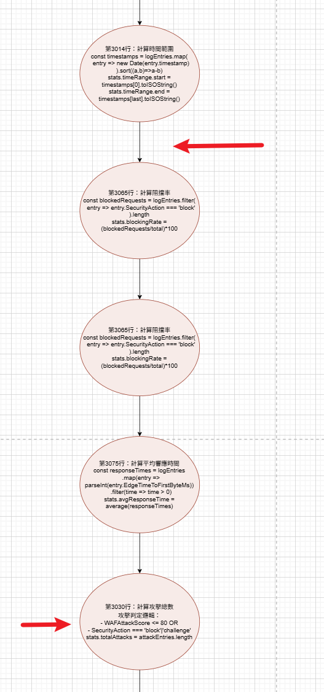
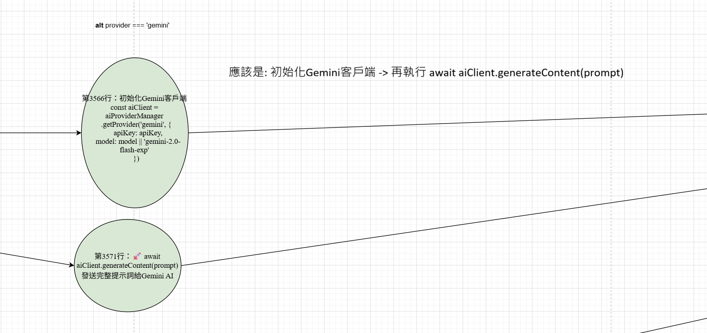
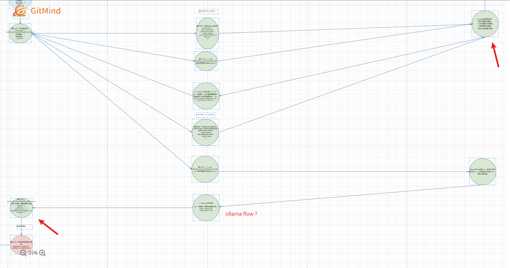

# ADAS-one-Demo-Doc
## AI.Lab 10/09 要給FLOW文件給AI.LA
- web http://10.168.10.102:3000
- 核對 https://github.com/jeff-cheng101/ADAS-one-Demo web -> backend flow 與 https://gitmind.com/app/docs/fa28hzj1 內容是否一致

--- 

## 疑似問題

- https://gitmind.com/app/docs/fa28hzj1 並沒有 if 判斷式表示式(給AI LAB的文件，不需要有IF條件的訊息嗎？)

- 在 processSecurityAnalysisData 部份，因為流程圖沒有顯示if判斷式，所以看到沒有顯示關於 queryActualELKData 流程 (查詢實際ELK資料（基於現有數據範圍）- 使用分批策略)

- 找不到 GET /cloudflare-logs/_search 觸發點

- (第3030行：計算攻擊總數，攻擊判定邏輯) 這段應該要移至 在 (設定統計時間) 後執行才對。

- 「執行AI分析」的部份, 看圖片內容以為是平行處理，應該是依序觸發才對

- 第3579行：優先使用自然語言分段解析 parseAnalysisFromMarkedText(text)，不論是 gemini 流程還是 ollama 流程，應該都會執行 parseAnalysisFromMarkedText(text)，流程圖文件劃的，感覺只有 ollama才會執行。

---

