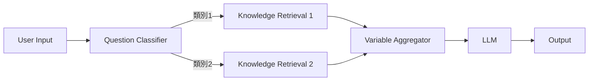

# Dify 工作流（Workflows）使用教學

## 1. 基本概念與應用場景

Dify 是一個開源平台，用於以視覺化方式定義流程、串接工具與資料來源，並部署具「代理式工作流」能力的應用。

工作流（Workflow）的核心價值是把複雜任務拆成多個節點（nodes）逐步處理，以提升可解釋性、穩定性與容錯性，降低對單一 Prompt 與模型推理能力的依賴。

Dify 也區分 Chatflow 與 Workflow：Chatflow 面向多輪對話；Workflow 面向自動化與批次處理（翻譯、資料分析、內容生成、Email 自動化等）。

---

## 2. 建立工作流：創建步驟與界面關鍵區塊

### 2.1 建立流程
1. 在 Dify Studio 建立「Workflow 應用」。
2. 在畫布(空白應用)加入 Start(開始) 類型節點（擇一）：
   - **User Input(使用者輸入)**：由使用者互動或 API 呼叫啟動。
   - **Trigger(觸發器)**：排程或事件驅動自動啟動。
3. 在 Start / User Input 設定 **Input Fields**（輸入欄位），定義要收集的資料（文字、檔案等），後續以變量引用。
4. 依需求拖曳節點（LLM、Knowledge Retrieval、HTTP Request…）到畫布並完成連線。
5. 逐一在節點設定面板配置參數（模型、提示詞、API 方法/URL、輸入輸出變量等）。
6. 使用 **Test Run / Run** 進行測試與除錯，確認輸出符合預期。
7. 視需要加入 Output（原 End）或 Answer 節點，把結果明確輸出給終端使用者或 API 呼叫端。

### 2.2 介面中最常用的除錯視圖
- **Variable Inspector（變量檢視器）**：每個節點執行後，輸入/輸出變量會出現在檢視區，可點開查看內容。  
- **Run History / Logs（歷史與日誌）**：可追蹤每次執行的節點順序、耗時、資料流向，用於定位瓶頸與錯誤。  

---

## 3. 節點類型：功能與用法總覽

下表整理 Workflow 常見節點與典型用途（名稱以官方文件為準）。

| 類別 | 節點 | 核心用途 | 典型輸入/輸出重點 |
|---|---|---|---|
| 啟動 | User Input / Start | 定義輸入欄位、取得使用者輸入/上傳檔案、系統變量 | 產出可被下游引用的輸入變量（如自訂欄位） |
| 啟動 | Trigger | 排程/事件驅動啟動（Schedule / Plugin / Webhook） | 可多個 Trigger 並行；可 Test Run 測試觸發 |
| 理解 | Question Classifier | 以 LLM 對輸入做語意分類並分流 | 分類結果對應不同分支路徑 |
| 生成 | LLM | 呼叫模型進行文字/多模態生成；支援結構化輸出與上下文管理 | Prompt 可引用 `{{variable}}`；可接 Knowledge Retrieval 作 context |
| 檢索 | Knowledge Retrieval | 查詢知識庫並輸出檢索結果供下游使用 | 結果可作為 LLM context，且可保留引用來源 |
| 整合 | HTTP Request | 呼叫外部 API/Web service（GET/POST…） | 回應可作為後續變量 |
| 整合 | Tools | 以預建整合連外，提供結構化介面、型別安全與內建錯誤處理 | 適合常見服務；降低手工 HTTP 設定成本 |
| 轉換 | Template | 用 Jinja2 組裝/格式化文字與結構 | 支援 `{{ var }}`、巢狀/陣列存取 |
| 轉換 | Code | 執行 Python/JavaScript 做計算、轉型、JSON 處理 | 需宣告 Input Variables，並回傳包含 Output Variables 的物件 |
| 控制流 | If-Else | 條件判斷分支（含 ELIF/ELSE） | 條件可引用任一上游變量（`{{...}}`） |
| 控制流 | Variable Aggregator | 合併分支輸出，提供單一一致變量給下游 | 解決分支後重複節點問題；要求同型別 |
| 控制流 | Iteration | 針對陣列逐項套用子工作流（可序列/並行） | 輸入需 Array；每次迭代提供 items/index 變量 |
| 控制流 | Loop | 以迴圈重複執行直到終止條件成立 | 常搭配 Code + If-Else + Template/Exit 節點模式 |
| 變量 | Variable Assigner | 將可寫變量（如 conversation variables）賦值保存 | workflow variables 單次執行；conversation variables 跨回合保存 |
| 輸出 | Output / Answer | 把結果回傳給使用者/API（Workflow 用 Output；Chatflow 用 Answer） | Output（原 End）在 Workflow 中用於明確輸出 |

---

## 4. 節點連接與資料流轉機制

### 4.1 串行與並行
- **串行（A → B → C）**：下游節點可引用任何已完成執行的上游輸出變量。  
- **並行（同一節點同時連出多條線）**：多個下游會同時執行，且「平行節點之間」不得互相引用彼此輸出。  

### 4.2 分支後的合流：Variable Aggregator
If-Else / Classifier 形成多條分支時，只會有其中一條分支實際執行；Aggregator 以「輸出哪條分支的值」作為統一變量，讓下游只寫一次（避免每條分支都複製一套 LLM/Template）。

---

## 5. 變量管理與參數配置

### 5.1 變量引用規則（核心）
- Dify 在節點設定中以 `{{variable_name}}` 引用變量；LLM 節點的 Prompt 與 Template 節點皆可使用。  
- LLM 節點可將 Knowledge Retrieval 的輸出接入為「context variables」，並在 Prompt 中引用（例：`{{knowledge_retrieval.result}}`）。  

### 5.2 Workflow Variables vs Conversation Variables
- **Workflow variables**：僅存在單次 workflow 執行期間，執行結束即重置。  
- **Conversation variables**：在同一 chat session 的多輪對話間持久化；可用 Variable Assigner 把 workflow 中間結果寫入 conversation variables，供後續回合引用。  

### 5.3 系統變量例（可用於追蹤）
文件列出 `sys.workflow_run_id` 作為 Workflow 執行識別，可用來追蹤歷史執行與日誌。

---

## 6. 條件判斷與邏輯分支

### 6.1 If-Else 設定要點
1. 選擇要判斷的變量（可從上游節點輸出挑選或用 `{{...}}` 填寫）。  
2. 設定條件運算與比較值；支援 IF / ELIF / ELSE 路徑。  
3. 各路徑配置不同處理節點；分支結束後以 Variable Aggregator 合流，提供一致輸出給下游。  

---

## 7. 測試與調試方法

### 7.1 整體測試（Test Run / Run）
1. 點選 Test Run，填入 Start / User Input 定義的輸入欄位。  
2. 觀察每個節點的輸入/輸出變量在 Variable Inspector 的變化。  
3. 以 Run History / Logs 檢查節點順序、耗時、資料流向。  

### 7.2 單節點測試與逐步執行（Step Run）
- 可針對任一節點進行單獨測試；逐步執行時，上游結果會被快取在 Variable Inspector，可直接修改快取變量後重跑下游節點。  
- Answer 與 End/Output 類節點不支援單節點測試。  

### 7.3 Trigger 測試（多觸發來源）
- 多 Trigger 時可用 Test Run 一次測試（Run all triggers）；最先觸發者會啟動工作流，其餘觸發來源會被忽略。  

---

## 8. 常見問題排查與最佳實踐

### 8.1 常見問題與定位
- **下游取不到變量**：節點未按依賴順序串行連接，或把依賴放在平行分支上；平行節點輸出不得互相引用。  
- **分支後下游節點重複堆疊**：缺少合流點；以 Variable Aggregator 統一分支輸出變量後再接下游。  
- **Iteration / Loop 內錯誤導致流程終止**：Loop 子節點失敗會立即停止；Iteration 可在設定中選擇子節點失敗的處理模式（文件描述其差異）。  
- **Knowledge Retrieval 有結果但 LLM 沒用到**：未把檢索結果接到 LLM 的 context variables，或 Prompt 未引用 `{{knowledge_retrieval.result}}`。  
- **Tool / HTTP 整合不穩定**：優先用 Tools（預建整合）以獲得結構化介面與內建錯誤處理；必要時才用 HTTP Request 自行控管細節。  

### 8.2 最佳實踐（可直接套用）
- 以「Question Classifier → 分支處理 → Variable Aggregator → 單一 LLM」作為常用骨架，降低維護成本。  
- 把格式化責任交給 Template（Jinja2），把生成責任交給 LLM，把計算/轉型責任交給 Code，避免單一節點承擔多種職責。  
- 以 Run History/Tracing 驗證節點耗時與路徑，先解「流程正確」再解「性能與成本」。  

---

## 9. Markdown 與 Mermaid：用於輸出與文件化

### 9.1 Markdown（用於 Answer/Output 的文字組裝、或專案文件）
```markdown
# 產出報告標題

## 摘要
- 重點 1
- 重點 2

## 結果表格
| 欄位 | 值 |
|---|---|
| A | 123 |
| B | 456 |

## 代碼片段
```bash
curl -X GET "https://api.example.com"
```

## 結果表格
| 欄位 | 值 |
|---|---|
| A | 123 |
| B | 456 |


```


### 9.2 Mermaid（用於把工作流「畫成可版本控」的流程圖）
下例用 flowchart 表示「分類 → 分支檢索 → 合流 → LLM → 輸出」：




---


## 附：一個可落地的最小範例（節點序列）
1. User Input：收集 `question`（文字）。
2. Question Classifier：把 `question` 分類成「產品」「帳務」「其他」分支。  
3. 每個分支接一個 Knowledge Retrieval（選不同知識庫）。  
4. Variable Aggregator：合流成 `kb_result`。  
5. LLM：Prompt 引用 `{{kb_result}}` 與 `{{question}}`，生成答案。  
6. Output：把 LLM 產出明確回傳給使用者/API。  
