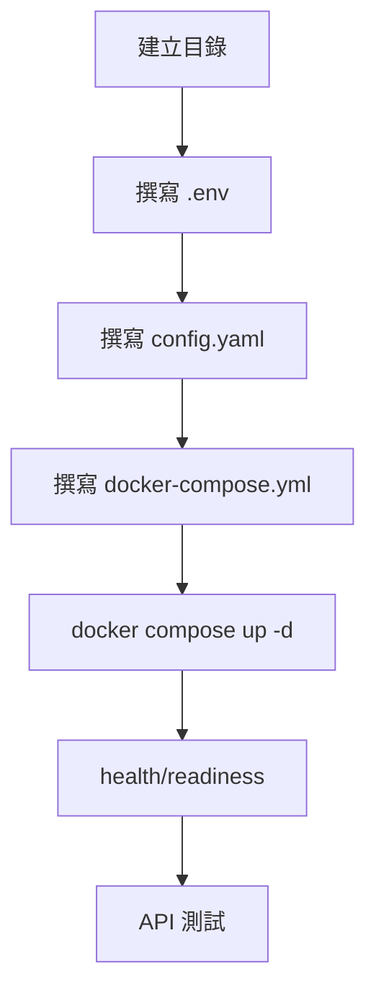

# LiteLLM Proxy 安裝與基礎配置標準作業程序（SOP）

##（Windows / Ubuntu 對照版）

* * * * *

## 0\. 文件目的與使用方式

本 SOP 用於讓 **不同技術背景的新成員** ，在不需理解 LiteLLM 內部實作的前提下，能夠：

- 正確部署 LiteLLM Proxy
- 完成必要設定
- 驗證服務可用
- 具備基本排錯能力

 **部署方式固定**

- Docker Compose
- 單節點（非 Kubernetes）
- 可擴充至正式環境

* * * * *

## 1\. 系統架構與元件說明

### 1.1 架構概覽

```java
Client
  │
  ▼
Nginx (80)
  │
  ▼
LiteLLM Proxy  (4000)
  │
  ├── PostgreSQL（資料持久化）
  └── Redis（快取 / 高併發輔助） 
  ```

### 1.2 元件職責

| 元件 | 角色 |
| --- | --- |
| LiteLLM Proxy | OpenAI-compatible API Gateway |
| PostgreSQL | 儲存 Virtual Keys、Models、Usage |
| Redis | Cache、狀態同步、避免 DB deadlock |
| Nginx | 反向代理、SSE/Streaming 支援 |

* * * * *

## 2\. 專案目錄結構（所有環境一致）

```pgsql
litellm/
├── docker-compose.yml
├── .env
├── config.yaml
├── pg_data/
├── redis_data/
├── prometheus_data/
├── backups/
├── nginx/
│   └── nginx.conf
└── prometheus/
    └── prometheus.yml 
```

* * * * *

## 3\. 安裝前置需求

### 3.1 Windows

- Windows 10 / 11（x64）
- Docker Desktop（已啟用 Docker Compose v2）
- PowerShell

### 3.2 Ubuntu

- Ubuntu 20.04 / 22.04 LTS
- 可使用 sudo
- 已能連線 Docker Hub / GHCR

* * * * *

## 4\. Windows 安裝教學

### 4.1 工作目錄（已確定）

`C:\work\TW\litellm\  `

* * * * *

### 4.2 建立目錄與檔案（PowerShell）

```powershell
cd C:\work\TW\litellm

mkdir nginx, prometheus, pg_data, redis_data, prometheus_data, backups -ErrorAction SilentlyContinue 

New-Item .env -ItemType File -Force | Out-Null  
New-Item config.yaml -ItemType File -Force | Out-Null  
New-Item docker-compose.yml -ItemType File -Force | Out-Null  
New-Item nginx\nginx.conf -ItemType File -Force | Out-Null  
New-Item prometheus\prometheus.yml -ItemType File -Force | Out-Null  
```

* * * * *

### 4.3 `.env`（必要）

 **路徑**

`C:\work\TW\litellm\.env  `

```env
LITELLM_MASTER_KEY="sk-admin-secret-key-CHANGE-THIS"
LITELLM_SALT_KEY="sk-salt-secret-DO-NOT-ROTATE"

# POSTGRES_USER=llmproxy
# POSTGRES_PASSWORD=secure_db_password_CHANGE_THIS
# POSTGRES_DB=litellm
# DATABASE_URL="postgresql://llmproxy:secure_db_password_CHANGE_THIS@db:5432/litellm"

# REDIS_HOST=redis
# REDIS_PORT=6379
# REDIS_PASSWORD=secure_redis_password_CHANGE_THIS

# OPENAI_API_KEY="CHANGE_THIS"
# AZURE_API_KEY="CHANGE_THIS"
```

 **重要限制**

- `LITELLM_SALT_KEY` 一旦使用後不可變更
- 遺失或變更 → 既有金鑰無法解密

* * * * *

### 4.4 `config.yaml`

 **路徑**

`C:\work\TW\litellm\config.yaml `

```yaml
model_list:
  - model_name: gpt-3.5-turbo
    litellm_params:
      model: openai/gpt-3.5-turbo
      api_key: "os.environ/OPENAI_API_KEY"

general_settings:
  master_key: os.environ/LITELLM_MASTER_KEY
  database_url: os.environ/DATABASE_URL
  use_redis_transaction_buffer: true
  database_connection_pool_limit: 10

litellm_settings:
  cache: true
  cache_params:
    type: redis
    host: os.environ/REDIS_HOST
    port: os.environ/REDIS_PORT
    password: os.environ/REDIS_PASSWORD

```

* * * * *

### 4.5 `nginx.conf`

 **路徑**

`C:\work\TW\litellm\nginx\nginx.conf  `

```nginx
events { worker_connections 1024; }

http {
  upstream litellm_backend {
    server litellm:4001;
  }

  server {
    listen 80;

    location / {
      proxy_pass http://litellm_backend;
      proxy_set_header Host $host;
      proxy_set_header X-Real-IP $remote_addr;

      proxy_buffering off;
      proxy_cache off;
      proxy_http_version 1.1;
      proxy_set_header Connection "";
      chunked_transfer_encoding on;
    }
  }
}

```

* * * * *

### 4.6 `docker-compose.yml`

```yaml
services:
  litellm:
    build:
      context: .
      args:
        target: runtime
    image: docker.litellm.ai/berriai/litellm:main-stable
    #########################################
    ## Uncomment these lines to start proxy with a config.yaml file ##
    # volumes:
    #  - ./config.yaml:/app/config.yaml
    # command:
    #  - "--config=/app/config.yaml"
    ##############################################
    ports:
      - "4001:4000" # Map the container port to the host, change the host port if necessary
    environment:
      DATABASE_URL: "postgresql://llmproxy:dbpassword9090@db:5432/litellm"
      STORE_MODEL_IN_DB: "True" # allows adding models to proxy via UI
    env_file:
      - .env # Load local .env file
    depends_on:
      - db  # Indicates that this service depends on the 'db' service, ensuring 'db' starts first
    healthcheck:  # Defines the health check configuration for the container
      test:
        - CMD-SHELL
        - python3 -c "import urllib.request; urllib.request.urlopen('http://localhost:4001/health/liveliness')"  # Command to execute for health check
      interval: 30s  # Perform health check every 30 seconds
      timeout: 10s   # Health check command times out after 10 seconds
      retries: 20    # Retry up to 3 times if health check fails
      start_period: 60s  # Wait 40 seconds after container start before beginning health checks

  db:
    image: postgres:16
    restart: always
    container_name: litellm_db
    environment:
      POSTGRES_DB: litellm
      POSTGRES_USER: llmproxy
      POSTGRES_PASSWORD: dbpassword9090
    ports:
      - "5432:5432"
    volumes:
      - postgres_data:/var/lib/postgresql/data # Persists Postgres data across container restarts
    healthcheck:
      test: ["CMD-SHELL", "pg_isready -d litellm -U llmproxy"]
      interval: 1s
      timeout: 5s
      retries: 30

  prometheus:
    image: prom/prometheus
    volumes:
      - prometheus_data:/prometheus
      - ./prometheus.yml:/etc/prometheus/prometheus.yml
    ports:
      - "9090:9090"
    command:
      - "--config.file=/etc/prometheus/prometheus.yml"
      - "--storage.tsdb.path=/prometheus"
      - "--storage.tsdb.retention.time=15d"
    restart: always

volumes:
  prometheus_data:
    driver: local
  postgres_data:
    name: litellm_postgres_data # Named volume for Postgres data persistence

```

* * * * *

### 4.6.1 `prometheus.yml`

```yaml
global:
  scrape_interval: 15s

scrape_configs:
  - job_name: "litellm"
    static_configs:
      - targets: ["litellm:4001"]

```

* * * * *

### 4.7 啟動與驗證（Windows）

```powershell
docker compose up -d
iwr http://localhost:4000/health/readiness -UseBasicParsing
```

* * * * *

## 5\. Ubuntu 安裝教學

### 5.1 安裝 Docker

```bash
sudo apt update
curl -fsSL https://get.docker.com | sudo sh
sudo usermod -aG docker $USER
newgrp docker
```

* * * * *

### 5.2 建立專案目錄

```bash
mkdir -p ~/litellm
cd ~/litellm
```

* * * * *

### 5.3 建立目錄與檔案

```bash
mkdir -p nginx prometheus pg_data redis_data prometheus_data backups
touch .env config.yaml docker-compose.yml
touch nginx/nginx.conf prometheus/prometheus.yml
```

* * * * *

### 5.4 編輯檔案

```bash
nano .env
nano config.yaml
nano docker-compose.yml
nano nginx/nginx.conf
```

 **內容與 Windows 完全一致**

* * * * *

### 5.5 啟動與驗證（Ubuntu）

```bash
docker compose up -d
curl http://localhost:4000/health/readiness
```

* * * * *

## 6\. 安裝流程圖（通用）



* * * * *

## 7\. 常見錯誤（實際發生過）

| 問題 | 原因 |
| --- | --- |
| Nginx 502 | LiteLLM 未在 4000 啟動 |
| PowerShell curl 失敗 | PowerShell ≠ Linux shell |
| 不斷重啟 | config / DB / Redis 錯誤 |

* * * * *

## 8\. SOP 結論

- 本文件可直接提供新成員照做
- 不需理解 LiteLLM 原理
- Windows / Ubuntu 唯一差異為指令語法
- 只要 `/health/readiness` 成功，即代表部署正確

 